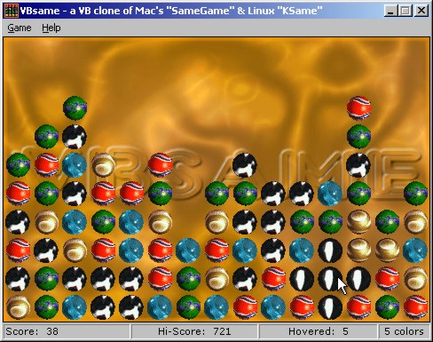

<div align="center">

## VBsame \- a VB clone of Mac's


</div>

### Description

Yes! the classic game hits the Windows platform and coded in VB!

the game is COMPLETE, that means no features are remaining, no bugs are inside and it is fully functional! this game will trap you for hours... why? i don't know, may be it's just the hunger for more points!

this version features the same things you can find in the Linux KSame (except for the undo feature that is really lame in this kind of games), plus nice sound and graphics.

Enjoy!
 
### More Info
 


<span>             |<span>
---                |---
**Submitted On**   |2002-08-12 00:18:44
**By**             |[gonchuki\_](https://github.com/Planet-Source-Code/PSCIndex/blob/master/ByAuthor/gonchuki.md)
**Level**          |Advanced
**User Rating**    |4.7 (47 globes from 10 users)
**Compatibility**  |VB 5\.0, VB 6\.0
**Category**       |[Games](https://github.com/Planet-Source-Code/PSCIndex/blob/master/ByCategory/games__1-38.md)
**World**          |[Visual Basic](https://github.com/Planet-Source-Code/PSCIndex/blob/master/ByWorld/visual-basic.md)
**Archive File**   |[VBsame\_\-\_a1169928112002\.zip](https://github.com/Planet-Source-Code/gonchuki-vbsame-a-vb-clone-of-mac-s__1-37849/archive/master.zip)

### API Declarations

```
First of all, sorry for the inconvenience...
PSC wouldn't let me upload the 148 Kb file with a 56K... well just lead to:
http://usuarios.lycos.es/nvtweaker/VBsame.zip
hope you like it!
gonchuki
```


